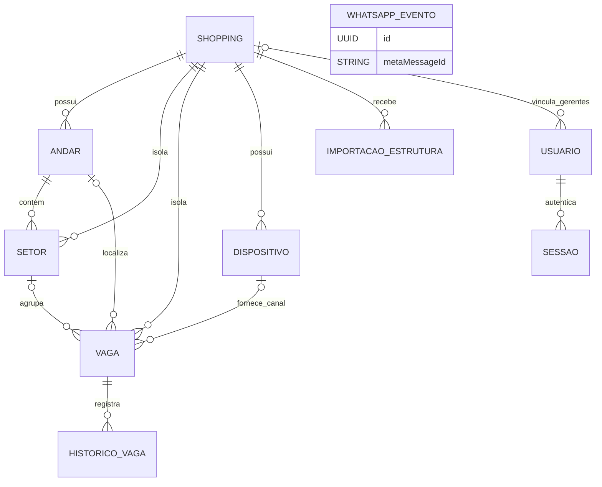

# Modelo de dados atual

Este documento explica o banco que existe no repositório em 23/09/2026. A fonte principal é o [`schema.prisma`](../../../vaggu-backend/prisma/schema.prisma); as migrations SQL acrescentam as restrições que o Prisma não representa, e os serviços do backend mostram onde cada registro é usado.

O documento não afirma que uma entidade planejada já foi implementada. Também não substitui as migrations: qualquer alteração do banco deve ser incremental e compatível com os dados existentes.

## Visão geral

`WhatsappEvento` aparece isolado porque sua deduplicação usa o identificador recebido da Meta; o schema atual não o relaciona a um usuário ou shopping.

## Enumerações atuais

| Enum | Valores existentes | Uso atual |
| --- | --- | --- |
| `Perfil` | `VAGGU`, `SHOPPING` | Distingue o Admin VAGGU do gerente vinculado a um shopping. |
| `TipoVaga` | `COMUM`, `PCD`, `IDOSO`, `ELETRICA` | Classifica a finalidade da vaga; não representa ocupação. |
| `EstadoVaga` | `LIVRE`, `OCUPADA`, `DESCONHECIDA` | Guarda o estado operacional atual e o histórico legado. Ainda não cobre o contrato planejado de indisponibilidade do P06. |
| `SituacaoImplantacao` | `NOVO_ATENDIMENTO`, `EM_ANALISE`, `DOCUMENTACAO_PENDENTE`, `APROVADO`, `EM_CONFIGURACAO`, `AGUARDANDO_INSTALACAO`, `ATIVO`, `REJEITADO`, `INATIVO` | Acompanha a implantação sem substituir o bloqueio institucional do shopping. |
| `WhatsappEventStatus` | `PROCESSANDO`, `PROCESSADO`, `FALHOU` | Controla o processamento idempotente de mensagens recebidas da Meta. |

## Entidades implementadas

### `Shopping` → tabela `shoppings`

**Finalidade:** representa cada shopping atendido e forma a raiz de isolamento dos dados administrativos e operacionais.

**Campos principais:** `id: UUID`; `nome: String`; dados institucionais, contato e endereço opcionais; `horarioAbertura` e `horarioFechamento: String(5)?`; `ativo: Boolean`; `situacaoImplantacao: SituacaoImplantacao`; `criadoEm: DateTime`; `excluidoEm: DateTime?`. A coluna legada `fuso_horario` permanece nullable no schema para compatibilidade, mas não é mais exposta no formulário nem no contrato administrativo atual.

**Relações e restrições:** possui usuários, dispositivos, vagas, andares, setores e importações. As relações usam exclusão restrita para preservar os registros. A exclusão feita pela API é lógica. Migrations validam formato da UF e dos horários.

**Uso atual:** cadastro, ficha, etapa de implantação, gerentes, estrutura e importação no painel administrativo.

### `Usuario` → tabela `usuarios`

**Finalidade:** representa os dois perfis humanos autenticados; gerente não é uma tabela separada.

**Campos principais:** `id: UUID`; `shoppingId: UUID?`; `nome`, `email`, `telefone?`; `senhaHash`; `perfil: Perfil`; `ativo: Boolean`; `trocarSenhaObrigatoria: Boolean`; `excluidoEm: DateTime?`; `ativoAntesExclusao: Boolean?`.

**Relações e restrições:** e-mail único. Um usuário `VAGGU` deve ter `shoppingId` nulo e um usuário `SHOPPING` deve ter shopping. A restrição de exclusão exige que `excluidoEm` e `ativoAntesExclusao` sejam preenchidos juntos e que um registro excluído esteja inativo. Possui zero ou mais sessões.

**Uso atual:** primeiro Admin criado por comando interno; gerentes criados pelo Admin; login, troca obrigatória de senha, edição da própria conta, bloqueio e exclusão reversível de gerente.

### `Sessao` → tabela `sessoes`

**Finalidade:** mantém sessões humanas opacas sem salvar o token original.

**Campos principais:** `id: UUID`; `tokenHash: String`; `usuarioId: UUID`; `criadoEm: DateTime`; `expiraEm: DateTime`.

**Relações e restrições:** `tokenHash` é único; a sessão pertence a um usuário e é apagada em cascata se o usuário for removido fisicamente. Há índices por usuário e expiração.

**Uso atual:** sessão opaca com validade de oito horas, entregue ao navegador por cookie HttpOnly e ainda aceita como `Bearer` para clientes existentes. Logout, bloqueio de gerente, redefinição de senha e exclusão lógica do shopping removem as sessões afetadas.

### `Andar` → tabela `andares`

**Finalidade:** organiza a estrutura e o mapa de cada pavimento.

**Campos principais:** `id: UUID`; `shoppingId: UUID`; `nome: String`; `ordem: Int`; `imagemMapa: String?`; `revisaoMapa: Int`; `ativo: Boolean`; `criadoEm: DateTime`.

**Relações e restrições:** pertence a um shopping e possui setores e vagas. Nome e ordem são únicos dentro do shopping; a ordem não pode ser negativa. O par `id + shoppingId` participa das chaves compostas que impedem cruzamento de shopping.

**Uso atual:** criação manual ou por importação, ordenação de pavimentos e controle de concorrência do mapa por `revisaoMapa`.

### `Setor` → tabela `setores`

**Finalidade:** agrupa as vagas de uma área do andar.

**Campos principais:** `id: UUID`; `shoppingId: UUID`; `andarId: UUID`; `nome: String`; `ativo: Boolean`; `criadoEm: DateTime`.

**Relações e restrições:** pertence simultaneamente ao shopping e ao andar; a chave estrangeira composta exige que ambos sejam do mesmo shopping. O nome é único no andar. Possui zero ou mais vagas.

**Uso atual:** cadastro manual, importação estrutural, filtros e agrupamento do mapa.

### `Vaga` → tabela `vagas`

**Finalidade:** identifica de forma estável uma vaga, sua categoria, localização e o estado operacional legado.

**Campos principais:** `id: UUID`; `shoppingId: UUID`; `andarId`, `setorId` e `dispositivoId: UUID?`; `codigo: String`; `tipo: TipoVaga`; posição proporcional opcional (`posicaoX`, `posicaoY`, `largura`, `altura`, `rotacao`); `canalSensor: String?`; `estadoAtual: EstadoVaga`; `ultimaLeituraEm: DateTime?`; `ativo: Boolean`.

**Relações e restrições:** pertence obrigatoriamente ao shopping. `andarId` e `setorId` permanecem opcionais apenas para compatibilidade com registros legados; quando preenchidos, as chaves compostas exigem o mesmo shopping e andar. O código é único no shopping. O par dispositivo/canal é único. Dispositivo e canal devem estar ambos preenchidos ou ambos nulos. A posição deve estar totalmente preenchida ou totalmente nula e usa proporções de zero a um.

**Uso atual:** estrutura manual/importada, visualização do mapa e preservação de ID durante atualizações. A rota de criação recebe apenas código e tipo; a posição é salva depois pela rota do mapa.

### `Dispositivo` → tabela `dispositivos`

**Finalidade atual:** base legada para um controlador ligado diretamente a canais armazenados nas vagas.

**Campos principais:** `id: UUID`; `shoppingId: UUID`; `nome: String`; `chaveApiHash: String`; `ultimoContatoEm: DateTime?`; `ativo: Boolean`.

**Relações e restrições:** pertence a um shopping e pode aparecer em várias vagas. A relação composta `dispositivoId + shoppingId` impede vincular a vaga a um dispositivo de outro shopping.

**Uso atual:** existe no schema e nas migrations, mas ainda não possui serviço ou endpoint operacional de telemetria. Não deve ser apresentado como monitoramento P06 concluído.

### `HistoricoVaga` → tabela `historico_vagas`

**Finalidade atual:** estrutura legada para registrar um estado associado a uma vaga.

**Campos principais:** `id: UUID`; `vagaId: UUID`; `eventoId: String`; `estado: EstadoVaga`; `registradoEm: DateTime`.

**Relações e restrições:** pertence a uma vaga; `eventoId` é único e evita duplicar esse identificador. A exclusão da vaga é restrita para preservar o histórico.

**Uso atual:** o schema preserva a base histórica, mas o fluxo P06 que produzirá eventos confiáveis ainda não foi implementado.

### `ImportacaoEstrutura` → tabela `importacoes_estrutura`

**Finalidade:** persiste a prévia CSV/XLSX e a fotografia do resultado confirmado para impedir reaplicação duplicada.

**Campos principais:** `id: UUID`; `shoppingId: UUID`; `formato: String(4)`; `previa: JSONB`; `resultadoConfirmacao: JSONB?`; `criadoEm: DateTime`; `confirmadoEm: DateTime?`.

**Relações e restrições:** pertence a um shopping com exclusão restrita. O formato aceita somente `CSV` ou `XLSX`; a prévia precisa ser um objeto JSON. Data e resultado de confirmação devem estar ambos preenchidos ou ambos nulos.

**Uso atual:** consulta da prévia, validação por linha e confirmação idempotente do P05. Os bytes originais do arquivo não são armazenados. O schema preserva mais de uma prévia por shopping; uma política de retenção ainda precisa ser decidida.

### `WhatsappEvento` → tabela `whatsapp_eventos`

**Finalidade:** deduplica e acompanha o processamento de mensagens recebidas pelo webhook da Meta.

**Campos principais:** `id: UUID`; `metaMessageId: String`; `tipo: String`; `status: WhatsappEventStatus`; `tentativas: Int`; `erroCodigo: String?`; `recebidoEm`, `processadoEm?` e `atualizadoEm: DateTime`.

**Relações e restrições:** `metaMessageId` é único. Não há relação atual com shopping, demonstração ou chamado.

**Uso atual:** idempotência técnica do webhook e registro de falha/processamento; não equivale a uma conversa comercial completa.

## Limites do modelo atual para o P06

Os campos de `Dispositivo`, `Vaga` e `HistoricoVaga` são uma base antiga, mas não implementam a telemetria confiável especificada para o P06:

- não existe uma entidade `Sensor`; o canal está embutido na vaga;
- não há identidade de inicialização do ESP32, sequência nem controle persistente completo de eventos recebidos;
- não há estado candidato, início/continuidade da confirmação de 30 segundos nem observação por sensor;
- `ultimoContatoEm` do dispositivo não comprova que todos os sensores vinculados funcionam;
- o enum atual usa `DESCONHECIDA` e ainda não representa de forma final a indisponibilidade causada por dado expirado;
- o histórico não separa instante efetivo, instante de recebimento, estado anterior, origem e motivo;
- não existem ocorrências de equipamento/manutenção nem rotina persistente de expiração;
- não existem serviços ou endpoints de placa, sensor ou ingestão no backend atual.

Portanto, os campos existentes não autorizam tratar heartbeat como leitura de sensor, dado expirado como vaga livre ou `HistoricoVaga` como histórico operacional completo.

## Entidades planejadas, ainda não implementadas

A lista abaixo resume propostas do SSD. Os nomes e a separação em tabelas ainda precisam ser conciliados com firmware, retenção, migrations e testes; nenhuma delas aparece hoje como modelo Prisma independente.

| Proposta | Necessidade prevista | Relação com o modelo atual |
| --- | --- | --- |
| `Placa` e `Sensor` | Separar o controlador ESP32 de cada canal físico, autenticar a placa e acompanhar observação/expiração por sensor. | Deve substituir ou evoluir `Dispositivo` e os campos de canal embutidos em `Vaga`, sem perder vínculos. |
| `EventoOcupacao` | Guardar transições confirmadas com estados anterior/novo, instantes efetivo e recebido, origem e motivo. | Evolução proposta de `HistoricoVaga`; não deve recriar IDs das vagas. |
| `ControleEventoRecebido` | Deduplicar telemetria por placa, inicialização e sequência e registrar seu resultado. | `eventoId` único no histórico atual não cobre sozinho todo o processamento. |
| `EventoEquipamento` e `OcorrenciaTecnica` | Preservar falhas, retornos e manutenções de placa/sensor sem ocorrências repetidas. | Ausentes no schema atual. |
| `MapaAndar` e `PosicaoVaga` | Separar mapas/revisões e posições caso o produto precise preservar versões. | Hoje `imagemMapa`/`revisaoMapa` ficam em `Andar` e as coordenadas ficam em `Vaga`. Uma migração só é necessária se essa separação for confirmada. |
| `DocumentoShopping` | Referenciar documentos privados e seu estado. | Não existe no escopo atual. |
| `Importacao` e `ErroImportacao` | Representar arquivo, processamento e erros estruturados separadamente. | O P05 atual usa `ImportacaoEstrutura` com prévia e erros dentro de JSONB. Não criar tabelas novas sem uma necessidade de consulta demonstrada. |
| `SessaoWhatsApp`, `PedidoDemonstracao` e `ChamadoSuporte` | Estruturar jornada comercial e suporte além da deduplicação do webhook. | `WhatsappEvento` registra processamento técnico, não esses fluxos de negócio. |
| `LogAcao` | Registrar ações administrativas relevantes sem segredos. | Ausente no schema atual. |

Telão, alerta e relatório não possuem entidade implementada. A forma de autorização do telão e as views analíticas devem ser definidas pelos pacotes P07–P09 antes de criar tabelas ou contratos.

## Regras para evoluir o banco

1. Preservar o isolamento por `shoppingId` com chaves compostas ou validação equivalente no banco e no backend.
2. Manter os IDs de vagas ao importar, reposicionar ou trocar sensores.
3. Criar migrations incrementais; nunca resetar um banco real para acomodar o P06.
4. Definir backfill e compatibilidade antes de separar `Dispositivo`, `Sensor` e `HistoricoVaga`.
5. Não enviar `senhaHash`, `chaveApiHash`, token de sessão ou conexão do banco ao frontend, relatórios ou exportações.
6. Validar o modelo novo pelos cenários CA15–CA24 do [plano e critérios de aceite](plano-e-aceite.md) antes de declarar P06 concluído.
