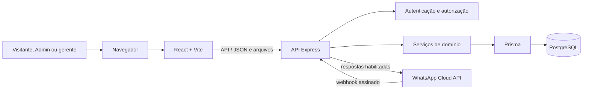
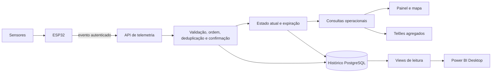

# Tecnologias e arquitetura

**Tipo:** TRD resumido · **Atualização:** 24/09/2026 · **Fontes do estado real:** manifests, código, migrations e testes versionados.

   

Os ícones vêm do catálogo [Simple Icons](https://github.com/simple-icons/simple-icons) exibido por [Shields.io](https://shields.io/docs/logos). São decorativos e externos; a tabela abaixo continua sendo a fonte textual e funciona sem eles.

Este documento apresenta as escolhas técnicas e separa o que está implementado do que continua planejado. Versões com `^` ou faixas reproduzem os manifests. A publicação no Render e o uso do Neon estão registrados em 23/09; esta revisão não aferiu disponibilidade externa ou homologação.

## Tecnologias implementadas

| Tecnologia e versão declarada | Onde é usada | Finalidade | Motivo no projeto | Estado real |
| --- | --- | --- | --- | --- |
| React `^19.2.8`, React DOM `^19.2.8` | `vaggu-frontend` | Landing, autenticação, área Admin e painel do gerente. | Componentização e atualização declarativa da interface responsiva. | Implementado. |
| Vite `^8.2.2` | `vaggu-frontend` | Desenvolvimento, build e proxy local de `/api`. | Ciclo curto de desenvolvimento e bundle do frontend. | Implementado; o build React é entregue pelo Express no Render. |
| TypeScript `^6.0.3` no frontend e `^7.0.2` no backend | Ambos os pacotes | Contratos, validação estática e manutenção. | Reduzir ambiguidades entre interface, domínio e API. | Implementado nos manifests atuais. |
| React Router DOM `^7.18.3` | `vaggu-frontend/src/main.tsx` | Rotas públicas, troca de senha e áreas protegidas por perfil. | Centralizar navegação e separar jornadas de visitante, Admin e gerente. | Implementado. |
| Tailwind CSS `^4.3.3` | `vaggu-frontend` | Tema, layout e responsividade. | Reutilizar tokens e compor estilos sem criar outra camada de design. | Implementado. |
| Radix UI `^1.6.7`, shadcn `^4.20.1` e componentes Radix específicos | `vaggu-frontend/src/components/ui` | Diálogos, controles e composição acessível. | Oferecer primitivas reutilizáveis sem substituir a identidade VAGGU. | Implementado parcialmente conforme os componentes presentes. |
| Lucide React `^1.39.0`, Motion `^13.2.0`, Poppins e Geist `^5.3.0` | Interface e landing | Ícones, movimentos, tipografia e acabamento. | Sustentar a linguagem visual; por decisão da equipe, as animações não são suprimidas pela preferência de movimento do sistema. | Implementado; medidas exatas ainda dependem de nova comparação com o Figma. |
| Node.js `>=22.12.0 <25` | `vaggu-backend` | Runtime da API, scripts e testes. | Compartilhar o ecossistema TypeScript e usar APIs nativas para segurança e testes. | Faixa obrigatória do backend. |
| Express `^5.1.0` | `vaggu-backend/src` | Rotas REST, middleware e webhook. | API HTTP direta e compatível com a escala do TCC. | Implementado. |
| Helmet `^8.1.0` | Montagem da API | Cabeçalhos HTTP de proteção. | Aplicar uma base segura sem espalhar configuração nas rotas. | Implementado; a publicação atual mantém frontend e API na mesma origem. |
| `node:crypto` com scrypt | Módulo de autenticação | Hash de senhas, tokens e comparação segura. | Evitar senha reversível e manter a credencial provisória apenas na resposta imediata. | Implementado. |
| PostgreSQL + Prisma `7.10.0`, adaptador pg `^7.10.0` e pg `^8.23.0` | Schema, migrations, serviços e testes do backend | Persistência relacional, integridade, transações e isolamento por shopping. | As regras dependem de vínculos e operações atômicas que o banco deve garantir. | Implementado; registro da equipe indica banco Neon para a hospedagem. Versão do servidor remoto não consta do repositório. |
| Render, manifesto `render.yaml` | Serviço web `vaggu-tcc` | Executar Express, servir o build React e verificar prontidão. | Manter interface e API sob a mesma origem e conexão privada com o banco. | Configuração e publicação registradas em 23/09; URL e estado atual do serviço não foram conferidos nesta revisão. |
| GitHub Actions, workflow `publicar-render.yml` | Repositório, branch `main` | Solicitar novo deploy pelo hook do Render. | Compensar a ausência de eventos automáticos na ligação por URL pública registrada pela equipe. | Workflow commitado; execução depende do segredo `RENDER_DEPLOY_HOOK_URL`, não verificável no Git. |
| `read-excel-file` `^9.3.10` e leitor CSV próprio | Módulo de importação | Prévia e confirmação de arquivos CSV/XLSX. | Importar estrutura com validação por linha sem adicionar outra biblioteca para CSV. | P05 concluído em 21/09/2026, inclusive confirmação idempotente no PostgreSQL. |
| WhatsApp Cloud API, sem SDK versionado | Backend `whatsapp` e links do frontend | Webhook assinado, deduplicação, envio de texto e encaminhamento comercial. | Manter o WhatsApp como canal de parceria e suporte. | Parcial: infraestrutura e menu demonstrativo existem; fluxo P10 e número oficial estão pendentes. |
| ESLint `^10.9.1`, Node Test Runner e Supertest `^7.1.4` | Verificação dos pacotes | Lint, compilação e testes HTTP/unitários/integração. | Verificar contratos e regressões com poucas dependências adicionais. | Implementado. |

## Tecnologias e componentes planejados

| Tecnologia ou componente | Onde entrará | Finalidade | Motivo no projeto | Estado |
| --- | --- | --- | --- | --- |
| ESP32 + firmware | Maquete e instalação | Autenticar o controlador, ler sensores e enviar sequência/reinicialização. | Controlador acessível para a demonstração e capaz de agrupar sensores. | P06; contrato ainda precisa ser estabilizado. |
| Sensores ultrassônicos + Wi-Fi | Vagas e comunicação local | Observar ocupação e transmitir leituras. | Base física prevista para a maquete do TCC. | Planejado; topologia e frequências dependem de ensaio. |
| Serviço de confirmação e expiração | Backend | Confirmar mudança após 30 segundos consistentes, ordenar/deduplicar eventos e invalidar dados antigos. | Dado ausente ou expirado não pode virar vaga livre. | P06, não implementado. |
| Atualização operacional por polling controlado ou transporte a confirmar | API e frontend | Atualizar mapa e telões sem recarga manual. | Separar o contrato de estado do transporte e adequá-lo à hospedagem disponível. | Decisão pendente; Socket.IO não está instalado. |
| Telões web | Frontend + API agregada | Mostrar vagas livres por andar/setor e categorias especiais sem duplicação. | Reutilizar a fonte confiável do mapa em monitores convencionais. | P07, não implementado. |
| Views PostgreSQL + Power BI Desktop | Camada analítica | Métricas, histórico e primeiro relatório funcional. | Manter análise separada da operação e reconciliar números com conjunto controlado. | P09, não implementado; modo Importação é a proposta inicial. |

## Arquitetura atual

O backend é a autoridade das permissões e deriva o shopping da sessão do gerente. O frontend não concede acesso ao ocultar controles. A base atual cobre autenticação, administração, estrutura, mapa, importação e uma integração parcial com o WhatsApp.

P01–P05 estão concluídos. Embora o schema já contenha `Dispositivo`, estado atual e `HistoricoVaga`, isso não comprova ingestão operacional: telemetria, confirmação, expiração, ocorrências, telões e análise continuam ausentes.

## Arquitetura planejada para a operação

A arquitetura planejada conserva dois caminhos: operação e análise. Mapa e telões usam o estado confirmado e sua validade; Power BI usa histórico e views restritas. Falha no relatório não pode interromper a leitura operacional.

## Decisões técnicas vigentes

- Uma API REST centraliza autenticação, autorização e regras de domínio.
- PostgreSQL é a fonte persistente única; migrations são incrementais e não se reseta banco real.
- Toda consulta do gerente precisa manter o recorte por shopping também em arquivos, exportações, atualização e análise.
- Senhas, hashes, credenciais de placas e conexão de banco nunca chegam ao frontend ou ao Power BI.
- A senha provisória aparece somente na resposta imediata de criação ou redefinição; apenas o hash permanece no banco.
- A confirmação da importação P05 é serializada por shopping e idempotente; vagas ausentes não são removidas silenciosamente.
- O transporte de atualização do P06/P07 ainda não foi escolhido. Polling é uma proposta compatível com o MVP; Socket.IO exige infraestrutura para conexão persistente.
- A hospedagem registrada é Render para API e frontend na mesma origem, com PostgreSQL no Neon; backup, monitoramento e homologação externa ainda requerem verificação.
- Power BI começa pelo Desktop e por histórico controlado; publicação, incorporação e segurança por linha dependem da forma de distribuição aprovada.

## Sequência técnica

1. **P06:** fechar contrato de firmware, autenticação, sequência, reinicialização, frequência e expiração antes dos endpoints definitivos.
2. **P07:** consumir apenas estados confiáveis para contagens, painel e telões.
3. **P08:** consolidar histórico, métricas e exportações com isolamento.
4. **P09:** criar views e primeiro relatório funcional no Power BI.
5. **P10:** concluir o fluxo do WhatsApp em trabalho independente quando número e ambiente Meta estiverem disponíveis.
6. **P11:** integrar e reproduzir o roteiro final do TCC.

## Referências

- Produto e escopo: [[Vaggu/Especificações/Visão do produto|visão do produto]].
- Regras e contratos: [[Vaggu/Documentação/SSD-VAGGU|SSD-VAGGU]].
- Arquitetura de estrutura, sensores e telões: [[Vaggu/Documentação/arquitetura-estrutura-sensores-telao]].
- Configuração local: [[Vaggu/Documentação/configuracao|configuração]].
- Critérios de aceite: [[Vaggu/Documentação/plano-e-aceite|plano e aceite]].
- Estado real e backlog: [[Vaggu/Documentação/planejamento-do-projeto|planejamento e continuidade]].
